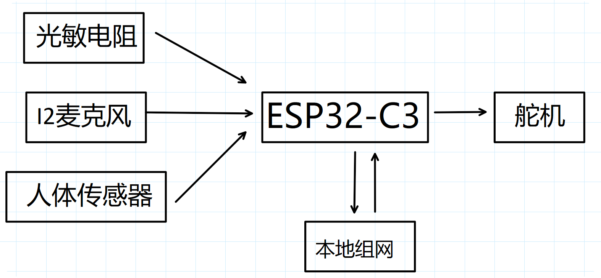
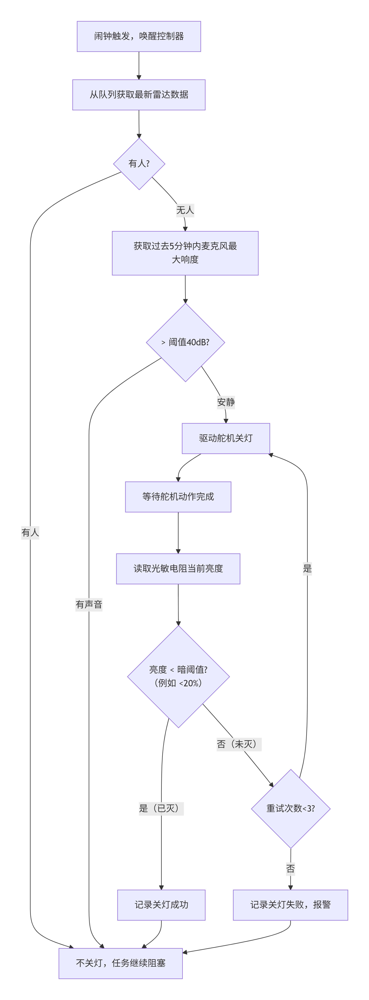

# 教室智能照明控制系统 – 技术原理文档（修正版）

## 1. 系统概述

本系统针对教室下课后无人时忘记关灯所造成的能源浪费问题，设计了一套基于 ESP32 的自动关灯装置。系统通过多传感器融合判断教室实际使用状态，结合定时策略，在确定无人后自动关闭照明。

**核心设计思想：**
- 采用 **FreeRTOS** 实时操作系统，创建独立传感器采集任务，通过队列传递数据。
- 综合**声音响度**（麦克风）和**人体存在**（24GHz 雷达）两个维度的信息，降低误判。
- 仅在**预定下课时间**（12:00 和 20:00）触发关灯检测，以避免舵机频繁动作。
- **光敏电阻用于舵机动作后判断开关是否关闭**：关灯后光线会变暗，光敏电阻通过检测光线来判断是否成功关灯。如果不成功，则增大舵机转动角度并上报局域网。

## 2. 硬件结构

### 2.1 主要元件


| 元件 | 功能 | 供电 | 连接引脚 |
| :--- | :--- | :--- | :--- |
| 麦克风模块（INMP441 类 I2S） | 采集环境声音响度 | 3.3V | SD→GPIO10, SCK→GPIO9, WS→GPIO8 |
| 24GHz 雷达人体传感器 | 检测是否有人 | 5V / 3.3V | 输出 GPIO7（数字高低电平） |
| 舵机 | 拨动物理开关（关灯） | 5V | PWM → GPIO6 |
| 光敏电阻分压电路 | 关灯后检测灯光是否熄灭（亮度反馈） | 3.3V | ADC → GPIO4 |

### 2.2 系统框图（文字描述）

```
麦克风(I2S)  →     ESP32  →  舵机(PWM) → 物理开关
雷达(GPIO)   →  (FreeRTOS)   ↑
光敏(ADC)    →               └── 关灯后反馈验证
```

## 3. 软件结构

### 3.1 FreeRTOS 任务设计

系统创建 **5 个任务** + **1 个队列**，分工如下：

| 任务名称 | 功能 |
| :--- | :--- |
| `vTask_Mic` | 读取 I2S 麦克风数据，计算平均响度（dB），发送至队列 |
| `vTask_Radar` | 读取 GPIO7，获取人体存在状态（0/1），发送至队列 |
| `vTask_Light` | 读取光敏 ADC 值，转换为亮度百分比（0~100%），发送至队列（备用） |
| `vTask_Controller` | 从队列接收传感器数据，并在闹钟触发时执行关灯逻辑 |
| `vTask_TimeCheck` | 检查 RTC 时间，到达 12:00 或 20:00 时通知控制器 |


### 3.2 数据队列设计

定义一个结构体，统一封装所有传感器数据：

```c
typedef struct {
    uint8_t sensor_type;   // 0=MIC, 1=RADAR, 2=LIGHT
    float value;           // 响度(dB) 或 人体(0/1) 或 亮度(%)
    uint32_t timestamp;    // 系统时间或 tick
} sensor_data_t;
```

队列长度设为 15，每个任务将数据压入队列，控制器任务阻塞读取。

### 3.3 关灯决策逻辑（控制器任务实现）

下图展示了完整的关灯判断与反馈流程：



**对应的逻辑步骤（文字描述）：**

1. 闹钟（12:00 或 20:00）触发，唤醒控制器任务。
2. 从队列获取最新的雷达数据：
   - 若检测到有人 → 不关灯，任务继续阻塞。
   - 若无人 → 进入下一步。
3. 获取过去 5 分钟内麦克风的最大响度：
   - 若最大响度 > 40dB（有声音） → 不关灯。
   - 若 ≤ 40dB（安静） → 执行舵机关灯动作。
4. 舵机动作后，读取光敏电阻亮度值：
   - 若亮度低于暗阈值（例如 20%），判定灯已灭 → 记录成功。
   - 若亮度仍高于阈值，判定关灯失败 → 增大舵机角度（每次增加 10°）并重试，最多重试 3 次；若仍失败，则通过串口或 Wi-Fi 上报局域网。
5. 记录结果，任务返回阻塞状态，等待下一个下课闹钟。

**补充说明：**
- **麦克风阈值**：40dB（安静教室约30dB，正常交谈约60dB）。
- **时间窗口**：关灯前要求 **连续 5 分钟** 无声音且雷达无人。
- **舵机动作**：初始转动 90° 拨动开关，动作后读取光敏确认；若未灭，则每次增加10°重试，最多3次。

## 4. 可靠性增强措施

| 风险场景 | 解决方案 |
| :--- | :--- |
| 少数学生在角落自习，雷达检测不到且不发声 | 关灯逻辑要求同时满足“无人”和“安静”。自习通常有翻书、写字声，麦克风应能捕获。若仍可能误关，可延长无声音判定时间至 15 分钟。 |
| 雷达覆盖范围有限 | 将雷达安装于教室中央顶部（覆盖半径 4~6 米）。若教室较大，可考虑使用两个雷达模块，通过 OR 逻辑判断。 |
| 舵机卡死或关灯失败 | 控制器每次动作后通过光敏电阻反馈验证，失败时增加角度重试，并上报报警信息。 |
| 电源断电后重启 | 系统上电后默认不主动关灯，仅等待下课时间触发。需内部 RTC 模块维持时间，并通过 NTP 校时。 |

## 5. 电源

采用低功耗 24GHz 人体传感器，优化硬件结构和代码，一节 **3000mAh 锂电池**可供电 **1-2 年**。可增加锂电池充电模块为锂电池充电。

## 6. 一个教室多个开关

可以使用一主一从的方案：主设备搭载传感器；从设备不接传感器，通过无线网络与主设备通讯，跟随主设备关灯。  
从设备也可以搭配单个传感器增强可靠性。

## 7. GPL 3.0 开源软件

整个项目实用性高，制作简单，故将代码开源于 [GitHub](https://github.com/misaka23300/turn-off-the-light)，以供爱好者、开发者学习交流，创建良好的学习社区。

